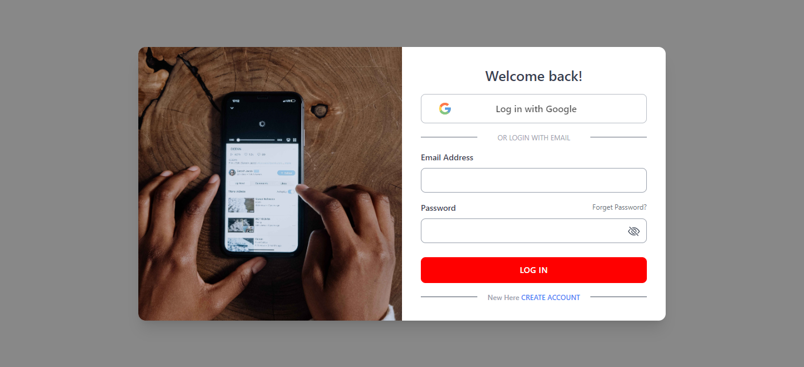
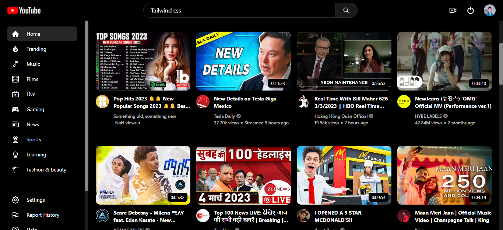
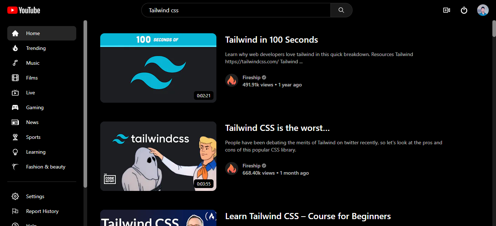
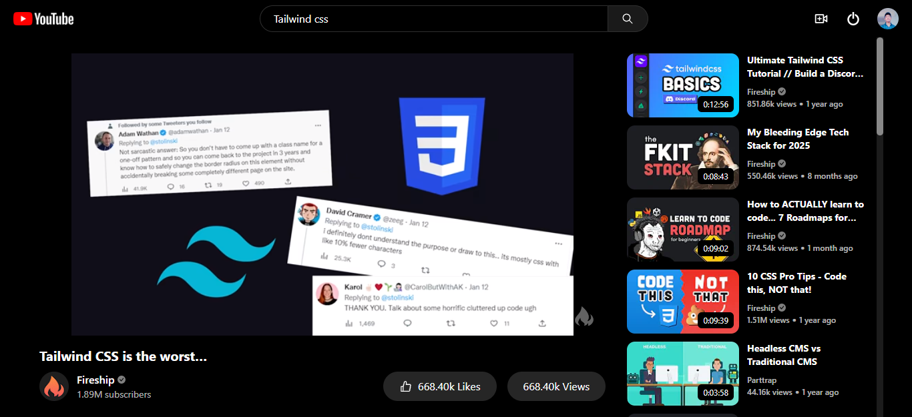

# Youtube with Authentication

## Description

This YouTube clone app built with React, Tailwindcss, Rapid API, and Firebase Authentication is a modern and secure platform for users to search and watch videos. It features a sleek user interface, Google and email authentication, and reliable backend services provided by Firebase.

## Links for Project

- ### 📌 [LIVE Project Link](https://ytclonewithauth.netlify.app/)

- ### 📌 [YouTube Link](https://youtu.be/qop9iV3RnQY)

## Tech Stack Used

## Key features:

- 🔍 Search for videos
- 📺 Watch videos
- 👤 Google and email authentication
- 💻 Modern user interface with React
- 🎨 Consistent design with Tailwind
- 🚀 Fast performance with Rapid API
- 🔒 Secure backend with Firebase Authentication and storage.

## API used:

### [YouTube API by: Glavier ](https://rapidapi.com/Glavier/api/youtube138/)

## Project Screen Shot(s)

### SignIn Page

### Home Page

### Search Results Page

### Video Details Page

#### [VISIT WEBISTE HERE](https://ytclonewithauth.netlify.app/)

#### [WACTH DEMO HERE](https://youtu.be/qop9iV3RnQY)

## Checkout Portfolio & Other Projects

### ⭐ [Personal Portfolio](https://shubhambhoj.in)

## Connect with Me

- [Mailto](mailto:shubhambhoj3@gmail.com)

- [LinkedIn](https://www.linkedin.com/in/shubham-singh-b122b7171/)

---

[GO TO TOP](#youtube-with-authentication)
